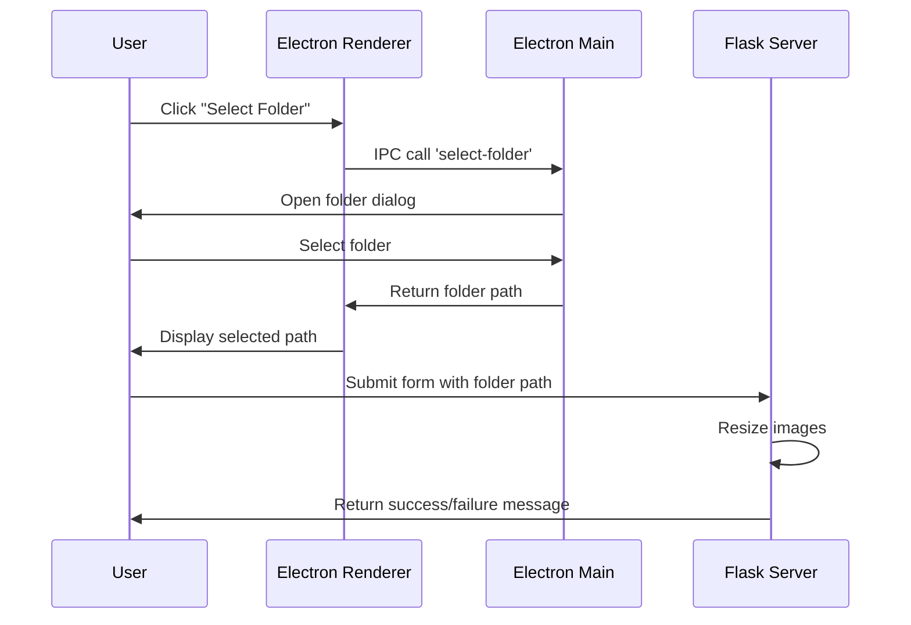

# 画像リサイザー (Image Resizer)

このプロジェクトは、画像をリサイズするためのElectronアプリケーションとFlaskバックエンドを組み合わせたものです。Electronアプリは、入力フォルダと出力フォルダを選択するためのGUIを提供し、Flaskアプリが画像のリサイズを処理します。

## 機能

- シンプルなGUIを使用して画像をリサイズ。
- 入力フォルダと出力フォルダを選択可能。
- 入力フォルダ内のすべての画像を指定したサイズにリサイズ。

## 前提条件

- Node.js と npm
- Python 3 と pip
- Flask

## セットアップ

### リポジトリのクローン

```sh
git clone https://github.com/oonisidesu/image_resize.git
cd image_resize
```

### 依存関係のインストール

#### Node.jsの依存関係

Node.jsの依存関係をインストールします。

```sh
npm install
```

#### Pythonの依存関係

Pythonの依存関係をインストールします。

```sh
pip install -r requirements.txt
```

### 設定

プロジェクト内のディレクトリ構成を以下のようにしてください:

```
image-resizer/
├── __tests__
│   └── example.test.ts
├── src
│   ├── electron
│   │   ├── main.ts
│   │   └── preload.ts
│   └── flask
│       ├── static
│       │   ├── css
│       │   │   └── styles.css
│       │   ├── js
│       │   │   └── main.js
│       │   └── ts
│       │       └── main.ts
│       └── templates
│           └── index.html
├── package.json
├── tsconfig.json
└── ...
```

## 使い方

### アプリケーションの実行

#### Flaskサーバーを起動

Flaskサーバーを起動します。

```sh
cd src/flask
python resize_images.py
```

#### Electronアプリを起動

別のターミナルウィンドウで以下を実行:

```sh
npm start
```

## スクリプト

- `npm run build`: TypeScriptファイルをコンパイルします。
- `npm run start`: プロジェクトをビルドし、Electronアプリケーションを起動します。
- `npm run lint`: ESLintを実行してリントエラーをチェックします。
- `npm run lint:fix`: ESLintを`--fix`オプション付きで実行してリントエラーを自動修正します。
- `npm run prettier:check`: Prettierを使ってコードフォーマットをチェックします。
- `npm run prettier:write`: Prettierを使ってコードをフォーマットします。
- `npm run test`: Jestでテストスイートを実行します。

## シーケンス



## ライセンス

このプロジェクトはMITライセンスの下でライセンスされています。詳細については[LICENSE](LICENSE)ファイルを参照してください。
